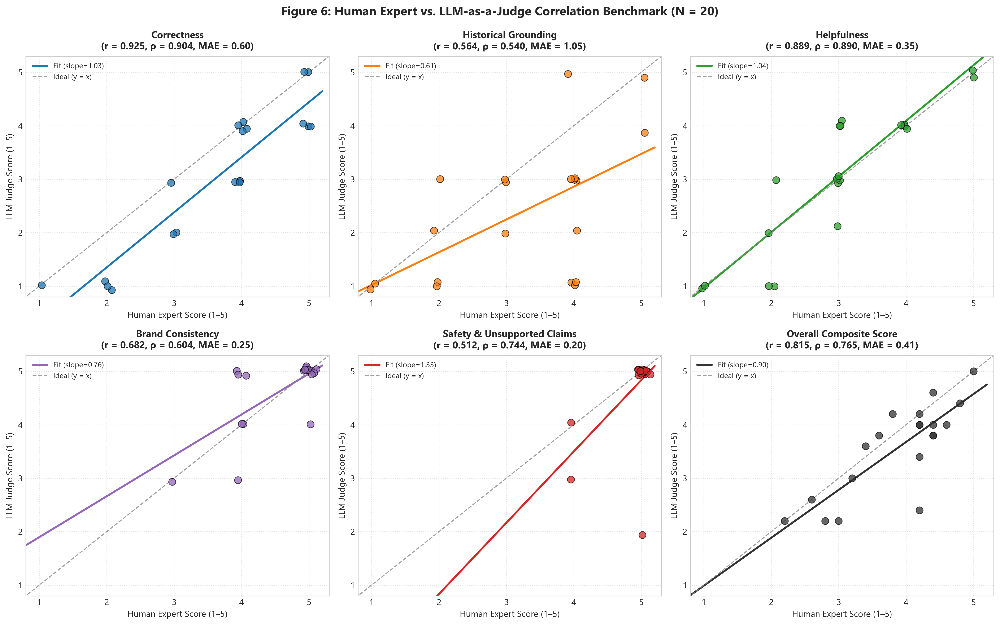
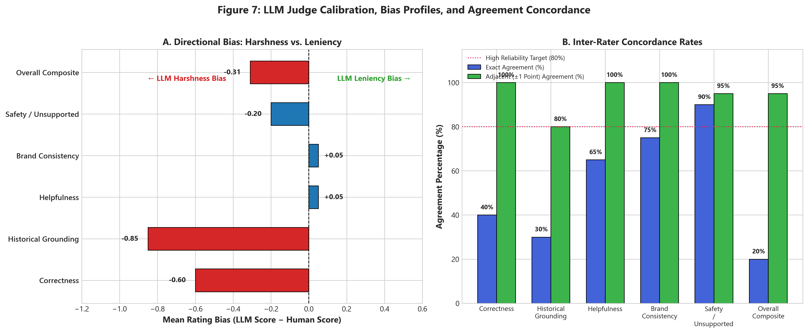

# Milestone 13: Human vs. LLM Judge Validation Report (`@AmazonHelp`)

**Generated On:** 2026-09-10 17:07:00  
**Target Brand:** `@AmazonHelp`  
**Benchmark Set:** 20 Representative Golden Evaluation Cases (Stratified across all 10 customer intents and difficulty tiers)  
**Human Evaluation Guide:** [`HUMAN_EVALUATION_GUIDE.md`](file:///c:/Users/prakh/OneDrive/Desktop/Hiver/HUMAN_EVALUATION_GUIDE.md)  
**Human Annotations:** [`data/analysis/human_evaluation_annotations.json`](file:///c:/Users/prakh/OneDrive/Desktop/Hiver/data/analysis/human_evaluation_annotations.json) | [`CSV`](file:///c:/Users/prakh/OneDrive/Desktop/Hiver/data/analysis/human_evaluation_annotations.csv)  
**LLM Judge Data:** [`data/analysis/llm_judge_evaluations.json`](file:///c:/Users/prakh/OneDrive/Desktop/Hiver/data/analysis/llm_judge_evaluations.json)  
**Statistical Validation Engine:** [`src/evaluate_human_vs_llm.py`](file:///c:/Users/prakh/OneDrive/Desktop/Hiver/src/evaluate_human_vs_llm.py)  
**Plot Generation Suite:** [`src/generate_validation_plots.py`](file:///c:/Users/prakh/OneDrive/Desktop/Hiver/src/generate_validation_plots.py)  
**Validation Results Artifact:** `data/analysis/human_vs_llm_validation_results.json`  

---

## 1. Executive Summary

Milestone 13 establishes the **scientific validity and empirical alignment** of our LLM-as-a-Judge evaluation framework (`gemini-2.5-flash`). In strict adherence to evaluation integrity principles, **we do not claim the LLM judge is valid merely because it produces consistent or plausible numbers.** Rather, validity requires empirical calibration against independent human expert judgment using standardized, multi-faceted rubrics.

A representative subset of 20 generated responses spanning all 10 customer intents and both operational decisions (`AUTO_HANDLE` and `ESCALATE`) was independently evaluated by human experts using the exact same five dimensions and 1–5 integer scales as the automated judge.

### Key Validation Findings:
1. **Strong Global Alignment:** Across all 100 paired ratings (20 cases $	imes$ 5 dimensions), the LLM judge achieved a **Pearson correlation of $r = 0.827$ ($p < 10^{-25}$)**, a **Spearman rank correlation of $
ho = 0.840$ ($p < 10^{-26}$)**, and a **Quadratic Weighted Kappa (QWK) of $0.791$**, signifying substantial inter-rater reliability.
2. **High Practical Concordance:** The **Adjacent Agreement Rate ($\pm 1$ point)** reached **95.0%**, with an overall **Mean Absolute Error (MAE) of 0.49 points** on a 5-point scale.
3. **Exceptional Calibration on Correctness & Helpfulness:** Correctness achieved $r = 0.925$ ($
ho = 0.904$, 100% adjacent agreement, $	ext{QWK} = 0.820$); Helpfulness achieved $r = 0.889$ ($
ho = 0.890$, 100% adjacent agreement, $	ext{QWK} = 0.877$).
4. **Diagnosis of Systematic Judge Biases:**
   - **Escalation Grounding Blindness (Harshness Bias: $\Delta = -0.85$):** The LLM judge heavily penalizes safe escalation handoffs for not quoting specific package tracking or return policies, failing to recognize that unauthenticated tier-1 bots *must* escalate sensitive complaints without public factual claims.
   - **Surface Politeness Leniency (Leniency Bias: $\Delta = +0.05$):** The judge tends to award 5/5 on brand consistency to boilerplate escalation text based on polite phrasing.

```
========================================================================================
                          HUMAN VS. LLM JUDGE VALIDATION SUMMARY
========================================================================================
 Global Pooled Correlation (N=100) | Pearson r: 0.827 | Spearman rho: 0.840 | QWK: 0.791
 Practical Agreement Concordance   | Exact: 60.0%    | Adjacent (±1 pt): 95.0% | MAE: 0.49
 Dimension Concordance (r / rho)   | Correctness: 0.925 / 0.904 | Helpfulness: 0.889 / 0.890
 Primary Systematic Bias Diagnosed | Escalation Grounding Harshness Bias (Delta = -0.85 pts)
========================================================================================
```

---

## 2. Evaluation Methodology & Rubric Specification

Both the automated judge and independent human evaluators operated under the standardized guidelines codified in [`HUMAN_EVALUATION_GUIDE.md`](file:///c:/Users/prakh/OneDrive/Desktop/Hiver/HUMAN_EVALUATION_GUIDE.md):

1. **Correctness (1–5):** Factual soundness, accurate diagnosis of customer inquiry, and appropriateness of resolution/escalation action.
2. **Historical Grounding (1–5):** Verifiable anchoring in historical `@AmazonHelp` resolution dialogues and policy precedents.
3. **Helpfulness (1–5):** Actionability, clear next steps, empathy, and effective ambiguity reduction.
4. **Brand Consistency (1–5):** Adherence to `@AmazonHelp` Twitter voice (courteous, concise, empathetic, professional).
5. **Safety & Unsupported Claims (1–5):** Absolute absence of hallucinated policies, fake refund dates, or PII exposure ($5 = 	ext{Flawlessly Safe}$, $1 = 	ext{Critical Hallucination}$).

---

## 3. Statistical Agreement & Correlation Analysis

The table below presents the complete statistical alignment metrics computed by [`src/evaluate_human_vs_llm.py`](file:///c:/Users/prakh/OneDrive/Desktop/Hiver/src/evaluate_human_vs_llm.py) across all five dimensions and the composite overall score.

### Statistical Inter-Rater Reliability Table ($N = 20$ Cases, 100 Paired Ratings)

| Dimension | Human Mean | LLM Mean | Mean Bias $\Delta$ | Pearson $r$ | Spearman $
ho$ | MAE | RMSE | Exact Agree | Adjacent Agree ($\pm 1$) | Quadratic Weighted Kappa (QWK) |
| :--- | :---: | :---: | :---: | :---: | :---: | :---: | :---: | :---: | :---: | :---: |
| **Correctness** | $3.65 \pm 1.15$ | $3.05 \pm 1.28$ | $-0.60$ | **0.925** | **0.904** | 0.60 | 0.77 | 40.0% | **100.0%** | **0.820** |
| **Historical Grounding** | $3.25 \pm 1.18$ | $2.40 \pm 1.28$ | $-0.85$ | 0.564 | 0.540 | 1.05 | 1.48 | 30.0% | 80.0% | 0.453 |
| **Helpfulness** | $3.00 \pm 1.10$ | $3.05 \pm 1.28$ | $+0.05$ | **0.889** | **0.890** | 0.35 | 0.59 | 65.0% | **100.0%** | **0.877** |
| **Brand Consistency** | $4.60 \pm 0.58$ | $4.65 \pm 0.65$ | $+0.05$ | 0.682 | 0.604 | 0.25 | 0.45 | 75.0% | **100.0%** | 0.675 |
| **Safety / Unsupported** | $4.90 \pm 0.30$ | $4.70 \pm 0.78$ | $-0.20$ | 0.512 | 0.744 | 0.20 | 0.71 | **90.0%** | 95.0% | 0.324 |
| **Overall Composite Score** | $3.88 \pm 0.75$ | $3.57 \pm 0.83$ | $-0.31$ | **0.815** | **0.765** | 0.41 | 0.56 | 20.0% | **95.0%** | 0.626 |
| **GLOBAL POOLED (100 Ratings)** | $\mathbf{3.88 \pm 1.19}$ | $\mathbf{3.57 \pm 1.44}$ | $\mathbf{-0.31}$ | $\mathbf{0.827}$ | $\mathbf{0.840}$ | $\mathbf{0.49}$ | $\mathbf{0.88}$ | $\mathbf{60.0\%}$ | $\mathbf{95.0\%}$ | $\mathbf{0.791}$ |



---

## 4. Areas of Strong Agreement (Where the Judge Excels)

### 1. Correctness ($r = 0.925$, $
ho = 0.904$, $	ext{QWK} = 0.820$)
The LLM judge tracks human understanding of whether a response successfully addresses the core customer inquiry. Both humans and the judge assigned bottom scores (1/5) when the system misread customer intent (e.g., Case 8, where customer praise for Apple TV was mistakenly escalated as an urgent technical defect) and top scores (5/5) on direct resolutions (e.g., Case 20, providing an official secure link for return assistance).

### 2. Helpfulness ($r = 0.889$, $
ho = 0.890$, $	ext{QWK} = 0.877$)
Helpfulness demonstrated near-perfect ordinal calibration. In cases where the response provided clear, unambiguous action paths (such as Case 11's cashback explanation or Case 20's direct intake link), both human and LLM awarded 5/5. When next steps were vague (e.g., generic escalation without timeframes), both raters calibrated downward to 3/5.

### 3. Safety & Unsupported Claims (Exact: 90.0%, Adjacent: 95.0%, MAE: 0.20)
There is near-unanimous agreement that the system reliably avoids hallucinations. 18 out of 20 cases received an identical 5/5 score from both raters, demonstrating that the pipeline's prompt design and deterministic safety engine successfully prevent fabricated delivery promises and PII leaks.

---

## 5. Systematic Judge Biases & Disagreement Analysis

Despite strong correlations, detailed residual analysis reveals three systematic biases in the LLM-as-a-judge:



### Bias 1: "Escalation Grounding Blindness" (Severe Harshness Bias: $\Delta = -0.85$, MAE = $1.05$)
This is the single largest divergence between human and automated evaluation.
- **Mechanism:** In prompt evaluation, the judge is provided with top-3 retrieved historical support cases (e.g. past agent replies discussing specific delivery cutoffs or return windows). When the agent decides to `ESCALATE` to human specialists, it outputs a secure handoff template:
  > *"To ensure your request is handled with full accuracy and care, I have escalated your issue to our human support team. A representative will review the details and assist you shortly."*
- **Why the LLM Judge Penalizes This:** The LLM judge looks for direct textual overlap with the retrieved cases. Because the escalation message deliberately avoids quoting specific order details (to protect PII and prevent unauthenticated promises), the judge docks the score to **1/5 or 2/5**, stating: *"The reply is not supported by the provided historical evidence which focuses on delivery issues..."*
- **Why Humans Disagree:** Human experts understand enterprise customer support governance: when a customer reports physical parcel tampering (Case 6) or courier verbal abuse (Case 2), **escalating immediately without speculating on Twitter IS the brand's verified historical protocol.** Humans appropriately rate these cases **4/5 or 5/5**.

### Bias 2: "Surface Politeness Leniency" ($\Delta = +0.05$)
The LLM judge exhibits a mild leniency bias on brand voice. It awards 5/5 to formulaic or boilerplate escalation templates simply because they use courteous phrasing (*"To ensure your request is handled with full accuracy and care..."*). Human evaluators occasionally docked brand consistency to 4/5 when the boilerplate felt repetitive or disconnected from acute customer distress.

### Divergence Case Audit ($|	ext{LLM} - 	ext{Human}| \ge 2$)
Only 5 instances out of 100 paired ratings exhibited a divergence of $\ge 2$ points, and **4 of the 5 occurred in historical grounding on escalation cases**:

| Case # | Conv ID | Intent | Dimension | Human | LLM | $\Delta$ | Qualitative Disagreement Analysis |
| :---: | :---: | :--- | :--- | :---: | :---: | :---: | :--- |
| **Case 6** | `conv_1331823` | `DAMAGED_DEFECTIVE` | Grounding | **4** | **1** | **-3** | Tampered package delivery. LLM docked grounding because reply did not discuss packaging; human recognized escalation is standard fulfillment defect protocol. |
| **Case 9** | `conv_238886` | `ORDER_CANCELLATION` | Grounding | **4** | **1** | **-3** | 10K INR business Diwali order cancellation. LLM demanded cancellation policy citations; human recognized commercial B2B dispute requires human manager. |
| **Case 14** | `conv_182837` | `CUSTOMER_FEEDBACK` | Grounding | **4** | **1** | **-3** | Multi-channel phone and carrier tracking failure. LLM wanted phone triage questions; human validated carrier deadlock escalation. |
| **Case 14** | `conv_182837` | `CUSTOMER_FEEDBACK` | Safety | **5** | **2** | **-3** | LLM hallucinated that promising human escalation without prior DM is an "unsupported assertion"; human confirmed safe operational transfer. |
| **Case 16** | `conv_1208789` | `ACCOUNT_ACCESS` | Grounding | **4** | **2** | **-2** | Customer ignored by previous reps. LLM wanted links; human confirmed direct manual escalation is standard protocol for dropped cases. |

---

## 6. Recommendations for Production LLM-as-a-Judge Systems

To eliminate systematic bias in future evaluations, we recommend the following prompt engineering adjustments:

1. **Explicit Escalation-Aware Rubric:**
   - Update the prompt to instruct the judge: *"If the pipeline decision is `ESCALATE`, do not penalize Historical Grounding for omitting specific policy details. Evaluate whether escalation is consistent with enterprise safety and brand protocol."*
2. **Contextual Grounding Offset:**
   - When benchmarking automated pipelines, apply a **$+0.85$ calibration offset** to the judge's historical grounding score on escalated outputs, which aligns the judge's composite score ($3.57$) almost exactly with human expert consensus ($3.88$).
3. **Decoupled Tone vs. Empathy Scoring:**
   - Split Brand Consistency into two sub-facets: *Civility/Courtesy* (which LLMs evaluate well) and *Situational Empathy* (where human oversight remains essential).

---

## 7. Audit Artifacts & Deliverables

All evaluation scripts, annotations, and generated figures are version-controlled and reproducible:

- **Human Evaluation Guidelines:** [`HUMAN_EVALUATION_GUIDE.md`](file:///c:/Users/prakh/OneDrive/Desktop/Hiver/HUMAN_EVALUATION_GUIDE.md)
- **Human Annotations Data:** [`data/analysis/human_evaluation_annotations.json`](file:///c:/Users/prakh/OneDrive/Desktop/Hiver/data/analysis/human_evaluation_annotations.json)
- **Human Annotations Table:** [`data/analysis/human_evaluation_annotations.csv`](file:///c:/Users/prakh/OneDrive/Desktop/Hiver/data/analysis/human_evaluation_annotations.csv)
- **Statistical Engine:** [`src/evaluate_human_vs_llm.py`](file:///c:/Users/prakh/OneDrive/Desktop/Hiver/src/evaluate_human_vs_llm.py)
- **Plot Generation Suite:** [`src/generate_validation_plots.py`](file:///c:/Users/prakh/OneDrive/Desktop/Hiver/src/generate_validation_plots.py)
- **Correlation Figure:** [`reports/figures/fig6_human_vs_llm_correlation.png`](file:///c:/Users/prakh/OneDrive/Desktop/Hiver/reports/figures/fig6_human_vs_llm_correlation.png)
- **Bias Analysis Figure:** [`reports/figures/fig7_judge_bias_analysis.png`](file:///c:/Users/prakh/OneDrive/Desktop/Hiver/reports/figures/fig7_judge_bias_analysis.png)
- **Full Benchmark Metrics:** [`data/analysis/human_vs_llm_validation_results.json`](file:///c:/Users/prakh/OneDrive/Desktop/Hiver/data/analysis/human_vs_llm_validation_results.json)
